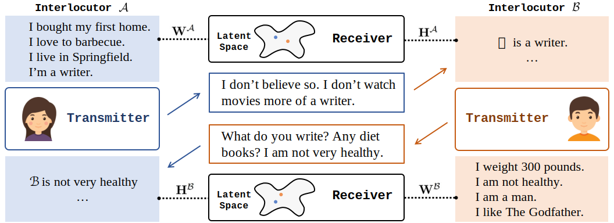
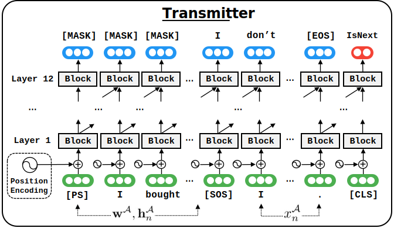
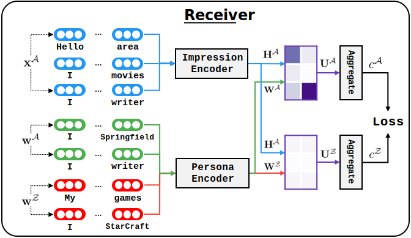

# ACL2020-Persona-Dialogue-Generation

This is the official code for our ACL 2020 paper [You Impress Me: Dialogue Generation via Mutual Persona Perception]().

## Task & Experiments


Our target task is **Open-domain Personalized Dialogue Generation**. As shown above, two interlocutors meet for the first time and are having a conversation in order to get to know each other. The model is aware of their persona, which are explicitly described using several profile sentences, facilitating the training of chatbots with configurable and persistent personalities.

We conduct experiments on [PersonaChat](http://convai.io/). And the main results on the validation dataset are as following (partial results of baselines are borrowed from [here](https://raw.githubusercontent.com/DeepPavlov/convai/master/leaderboards.md)):

| Setting   | Model  | PPL           | Hits@1  |   F1   |
| -------------       | ---      | :------------- | :-----  |  :----- |
|                     | Ours               | **15.12**&#x1F34E;   | 81.9   | **19.77**&#x1F34E; |
|                     | Transfertransfo    |  17.51 | **82.1**&#x1F34E;  |  19.09 |
|                     | Lost In Conversation  | -   | 17.3  | 17.79  |
|                     | Seq2seq-Attention | 35.07  	 | 12.5      | 16.82 |
|     Original        | Language Model     | 50.67       | - | 16.30 |
|                     | Generative Profile Memory     | 35.01   | 10.2   | 16.29	|
|                     | Dually Interactive Matching | - | 78.8 | - |
|                     | KV Profile Memory  | -	 |  54.8   | 14.25	| 

*Details about each baseline are shown in our paper.*

## Model Quick Overview



In this paper, we propose a a transmitter-receiver based framework with the aim of explicitly modelling **Persona understanding**, in other words, **Mutual Persona Perception**. 

It is based on the following motivation: the two interlocutors foster understanding either by raising persona-related topics, `Seen any good movies lately?`, or by revealing their own personas through answering questions, `I don't watch movies more of a writer.`. The efforts to build understanding keep the conversation flowing. 


## Install Dependencies

### Python Environment

First of all, you should setup a python environment. This code base has been tested under python 3.x, and we officially support python 3.7.

After installing python 3.7, we strongly recommend you to use `virtualenv` (a tool to create isolated Python environments) to manage the python environment. You could use following commands to create a environment.

```bash
python -m pip install virtualenv
virtualenv venv
```

### Activate Virtual Environment
Then you should activate the environment to install the dependencies. You could achieve it via using the command as below. (Please change $ENV_FOLDER to your own virtualenv folder path, e.g. venv)

```bash
$ENV_FOLDER\Scripts\activate.bat (Windows)
source $ENV_FOLDER/bin/activate (Linux)
```

### Install PyTorch

The most important requirements of our code base are `pytorch >= 1.0.1` and `tensorboardX`. You should install them at first.


### Install Custom Dependencies

Besides pytorch, our code is mainly based on [ParlAI](https://github.com/facebookresearch/ParlAI) and [Huggingface's transformers](https://github.com/huggingface/transformers) (pytorch-pretrained-bert v0.6.2) library. As they are under active development, for the purpose to reproduce our results, we provide two custom repos to install them. It is worth noting that we also modify a little on Huggingface's code to achieve the auxiliary task `Next Utterance Prediction` (See Section 3.1 in our paper), and more details on changes could be seen [here](https://github.com/SivilTaram/transformers/commit/e1e718496c32c0d99291c0b890fd4ae6365191ba). Assuming you current working directory is `./`, you can run the following script to install them:

```bash
cd ..
git clone https://github.com/SivilTaram/transformers.git
cd transformers
python setup.py install
cd ..
git clone https://github.com/SivilTaram/ParlAI.git
cd ParlAI
python setup.py install
cd ..
cd ACL2020-Persona-Dialogue-Generation
```

## Training

We provide three files to train `Transmitter`, `Receiver` and `PSquare` (details can be found in our paper). And the corresponding training scripts and commands are as below.

### Training Transmitter



The transmitter is based OpenAI's GPT model. The default hyper-parameters are expected to reproduce our paper results (if not, please open an issue or concat me via email). Therefore, you could use the following command to train a transmitter. The script will automatically download the ConvAI2 dataset into the `./data/` folder. 

```python
python train_transmitter.py
```

### Training Receiver

If you have downloaded the ConvAI2 dataset, you could use `./tasks/convai2receiver/build_data.py` to build the dataset for receiver:

```python
python tasks/convai2receiver/build_data.py
```




The backbone of our Receiver is BERT. And it is trained via a weak-supervision fashion. You could train the Receiver model as:

```python
python train_receiver.py
```

### Training PSquare

Before training PSquare, you should have a trained transmitter and receiver. Specifying the model names in line 33-42 in `train_psquare.py`, you can run the following script to execute the self-play procedure.

```python
python train_psquare.py
```

## Trained Model Weights

We also provide trained PSquare weights for reproducing our experimental results in the paper.

- Trained model weights under the Original setting: https://www.dropbox.com/s/ozw9xmfv4f0tud9/psqaure_original.zip?dl=0
- Trained model weights under the Revised setting: https://www.dropbox.com/s/bbvamaj9r019wsw/psqaure_revised.zip?dl=0

Please create a directory `./tmp/psquare`, and unzip the model zipped files into the directory as:

```bash
| -- tmp
    | -- psquare
        | -- psqaure_original.model
        | -- psqaure_original.model.opt
        | -- psqaure_original.model.best_valid
``` 

Then you could directly evaluate it using the following evaluation scripts.

## Evaluation

You could run `eval_f1.py`, `eval_hits.py` to obtain the `F1`, `Hits@1` for either Transmitter or PSquare. The evaluation logs on our provided model weights can be found in the folder `./logs/`.

As for the `ppl` metric, you could run the training script on a trained model file to fake the continuation of training. The restoring will first validate and report `ppl` on the validation dataset.

## Acknowledgement

The `parlai` module is modified from [ParlAI](https://github.com/facebookresearch/ParlAI). Thanks them for their huge contributions on developing such a great conversational platform (*Attention: usage on this module follows its open source License*) ! Also many thanks for Huggingface's transformer library!

## Concat

You could reach me via my email: qian dot liu at buaa dot edu dot cn. Or just feel free to open an issue :)

## Citation

Please consider citing our paper if it is helpful to you :)

```bib
@inproceedings{liu-etal-2020-personachat,
    title = "You Impress Me: Dialogue Generation via Mutual Persona Perception",
    author = "Liu, Qian  and
      Chen, Yihong  and
      Chen, Bei  and
      Lou, Jian-Guang  and
      Chen, Zixuan  and
      Zhou, Bin  and
      Zhang, Dongmei",
    booktitle = "Proceedings of the 58th Annual Meeting of the Association for Computational Linguistics",
    month = july,
    year = "2020",
    publisher = "Association for Computational Linguistics"
}
```

